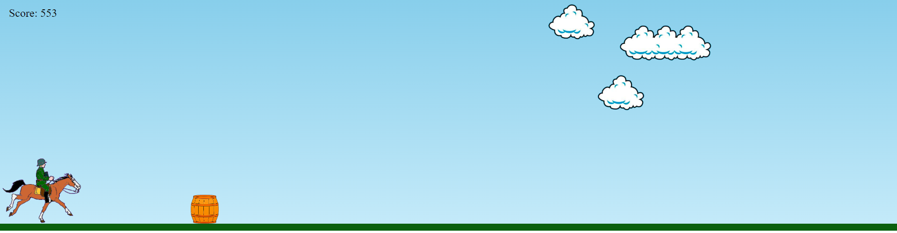

# children's jumping game


### ```Description```

This game is a simple game where you control a horse that needs to jump over barrels that appear on the way. The objective is to get as far as possible without hitting a barrel.

> The code is done in a simple way, where there is a variable ```horse```
refers to an HTML element that represents a horse,
while the variable ```barrel``` refers to an HTML element that represents a barrel.
The ```jump``` function adds the jump class to the horse element,
simulating a jump. The ```loop``` function is a time interval that runs every 10 milliseconds.
At this interval, the ```score``` variable is incremented and displayed on the screen. 
The code also checks to see if the barrel and the horse collided. If they collided,the game is stopped and a ```game over``` image is displayed.

### ```prerequisites```


To play this game, you will need a modern web browser that supports HTML, CSS and JavaScript.


### how to download

You can download the game from the repository on GitHub. To do this, just follow these steps:

1. Open the terminal on your computer.
2. lone the repository on your local machine:

```javascript
git clone https://github.com/Bscanto/Project-Games/children's-jumping-game
```
### How to run the game

To play the game, follow these steps:

1. Open the index.html file in your web browser.
2. Use up or down arrow keys to control the horse.
3. Try to jump over the barrels and get as far as possible.
4. To restart the game refresh your browser page

### Dependencies

This game does not require any specific library or software.

## Contributing

If you want to contribute to this project, simply fork the repository, make your changes and submit a pull request. I will be happy to evaluate your contributions! 

